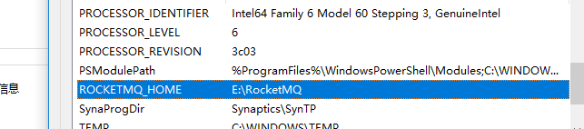
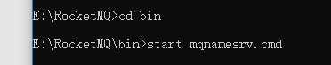
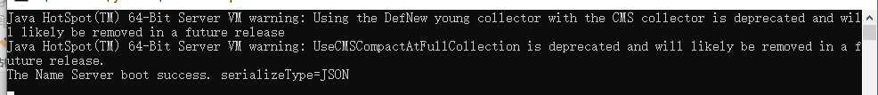

1配置环境变量（路径中不能有空格）
 
2下载RocketMQ并解压，cmd进入 bin目录下，输入命令start mqnamesrv.cmd 
启动namesrv 如下图
  
  
3 启动broker
Cmd命令框执行进入至‘MQ文件夹\bin’下，然后执行‘start mqbroker.cmd -n 127.0.0.1:9876 autoCreateTopicEnable=true’，启动BROKER。成功后会弹出提示框，此框勿关闭。
假如弹出提示框提示‘错误: 找不到或无法加载主类 xxxxxx’。打开runbroker.cmd，然后将‘%CLASSPATH%’加上英文双引号。保存并重新执行start语句。
